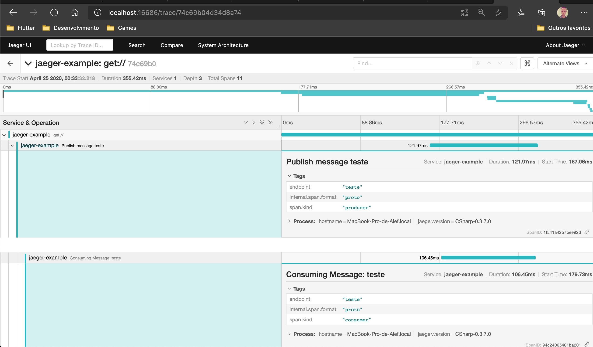

# Silverback + Opentracing

Propagates trace information through pub/sub pattern

> Inspired by [this project](https://github.com/yesmarket/MassTransit.OpenTracing)


## How to use

> Ensure that `GlobalTracer` is initialized

Just add `UseOpenTracing()`:

```csharp
public void ConfigureServices(IServiceCollection services)
{
    services.AddSilverback()
        .UseOpenTracing();;
}
```

This will add two [behaviors](https://beagle1984.github.io/silverback/docs/quickstart/behaviors) `ConsumerTracingBehavior` and `ProducerTracingBehavior`.

## Examples



See `examples/OpenTracing.Example` for full setup


Enjoy ;)
